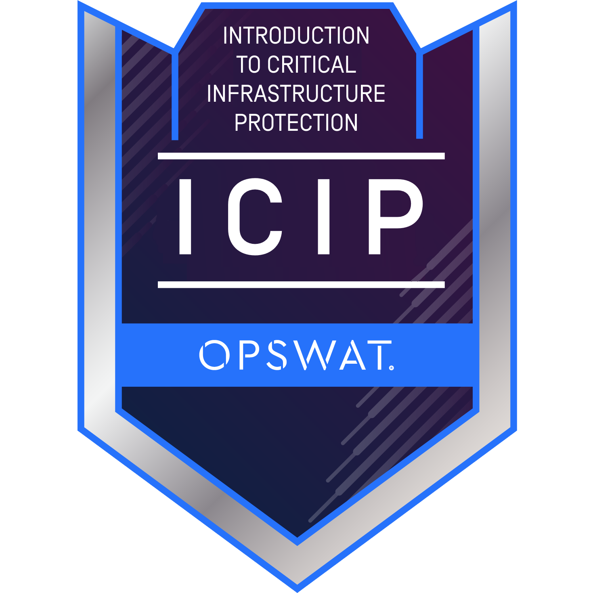

# Hi there! 👋 I'm MD ABUL HOSSAIN (my-expert-portfolio)

**Business | Offshore Architecture Engineer | Entrepreneur**

### 📚 Academic Citation & Verified DOI
This framework is officially registered and archived with the European Union open-access infrastructure: 👉 **Official DOI:** 

🔗 **Support My Work:** [💰 Become a Sponsor](https://github.com/sponsors/AnticipatedD) | [☕ Open Collective](https://opencollective.com/vane-guard)
Welcome to [my-expert-portfolio](https://mdabul.netlify.app)

---

## 🎯 About Me

I'm an experienced offshore architecture engineer and business entrepreneur focused on building enterprise-grade solutions for Fortune 500 companies including **Amazon** and **Google**. My expertise spans designing scalable systems, implementing AI-driven frameworks, and architecting robust cloud infrastructures.

As the founder and leader of **Vane Enterprise LLC**, I drive innovation through intelligent automation and sovereign AI frameworks. I'm deeply invested in open-source contributions and leading a talented team that delivers transformative technology solutions.

---

## 💼 Professional Background

- **Business Owner & Entrepreneur**: Founded and scaled Vane Enterprise LLC
- **Offshore Architecture Engineer**: Designed complex systems for Amazon, Google, and enterprise clients
- **Google Admin Console Expert**: Certified holder of Chrome Enterprise and Android Enterprise setup certifications
- **GitHub App Developer**: Creator of the "Vane-Guard-Sovereign-Orchestrator" deployed GitHub App
- **AI Researcher & Developer**: Specializing in preventing AI hallucinations and creating sovereign AI solutions

---

## 🛠️ Core Competencies

### **AI & Machine Learning**

### **Enterprise & Cloud Platforms**

### **Development**

### **Certifications & Learning**
- 🎓 **Android Enterprise Certified Developer**
- 📚 **Microsoft AI Integration Specialist** (In Progress)
- 🏅 **Microsoft Learn Profile**: [mdabulhossain-6486](https://learn.microsoft.com/en-gb/users/mdabulhossain-6486/)
- **Hospitality Security Management Course**: Issued by: **EEBSSA Online** [CERT-07C8537D5B](https://www.ebssa-online.net/student/certificate/CERT-07C8537D5B)
  
<!-- ==================================================================== -->
<!-- SECURE CERTIFICATIONS & CREDENTIAL ENGINES -->
<!-- ==================================================================== -->
<section style="max-width: 800px; margin: 30px auto; padding: 20px; background: #161b22; border: 1px solid #30363d; border-radius: 8px;">
    <h3 style="color: #c9d1d9; border-bottom: 1px solid #30363d; padding-bottom: 10px; margin-top: 0; font-size: 1.4rem;">
    </h3>  
   🛡️ Verified Security & Critical Infrastructure Credentials

<table>
  <tr>
    <td width="200" align="center" valign="top">
      
        
      <a href="https://credly.com" target="_blank"><strong>Verify Badge</strong></a>
    </td>
    <td valign="top">
      <h4>OPSWAT Introduction to Critical Infrastructure Protection (ICIP)</h4>
      
<strong>Issuing Organization:</strong> OPSWAT • Issued June 2026

      
Validates specialized industrial domain knowledge in securing Operational Technology (OT), Industrial Control Systems (ICS), and critical infrastructural digital assets against modern cyber threats.

      
🔗 <a href="https://credly.com" target="_blank">View Public Credly Verification Link</a>

    </td>
  </tr>
</table>

## 📊 GitHub Stats

---
# Vane-Guard Sovereign Framework (v1.0.0) 
### High-Precision Enterprise AI & Full-Stack RAG Infrastructure

 

---

## 🏆 Engineered by Elite Technical Talent
This framework is architected and maintained by a verified Top-30 Global AI Engineer:
* **AlphaNova Competition:** **Global Rank** **#30 / 613**
* **Global Leaderboard:** **Rank** **#11**
* **Developer Reputation:** **62.5**
* **Verified Scientific Contributions:** **2 Enterprise applications submitted through [Zenodo](https://doi.org) (EUROPEAN F&T Project framework).**

**⭐ If you're interested in deterministic AI, hallucination prevention, or enterprise solutions, let's connect!**

*Built with ❤️ by MD ABUL HOSSAIN | Vane Enterprise LLC*

---

## 📞 Quick Contact

- 📧 **Business Inquiries:** Contact via [Vane Enterprise Portal](https://vane-enterprise.github.io)
- 💬 **Social Media:** [@harigov63 on X](https://x.com/@harigov63)
- 📺 **Content & Updates:** [YouTube Channel](https://www.youtube.com/vane-enterprise-llc)
- 🤝 **Professional:** [GitHub Discussions](https://github.com/myou260312-eng)

---

*Copyright © 2026 MD ABUL HOSSAIN. All Rights Reserved.*
